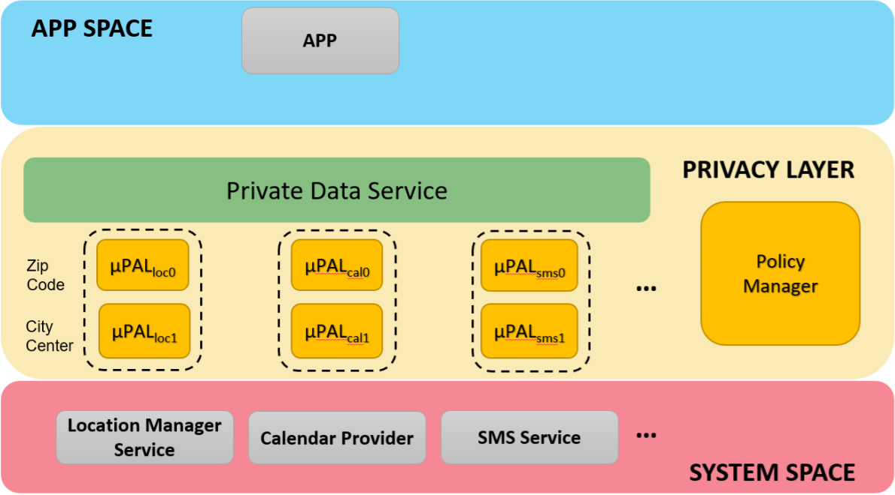

# Privacy Enhancements for Android

## Overview

Privacy Enhancements for Android (PE for Android) is a platform for exploring
concepts in regulating access to private information on mobile devices. We
developed PE for Android as a fork of the [Android Open Source Project
(AOSP)](https://source.android.com) release for Android 9 "Pie."

PE for Android offers new APIs that facilitate the development of swappable
componenents that are invoked when apps request private data. This includes
*Policy Managers* that can log and decide on requests to access sensitive
information. Additionally, PE for Android offers the *Private Data Service*
and associated modules dubbed *uPALs*, which transform private data into
less sensitive forms (e.g., from full-resolution GPS coordinates to just
a zip code). This modular architecture allows for the experimentation of
various models for how apps use sensitive data and how users can gain
insight into that.

*Apps interface with the Privacy [Abstraction] Layer (PAL). This contains
the Policy Manager for regulating access to sensitive services, and uPALs
to transform sensitive data prior to returning it to the requesting app.*

For more details: [Full PE for Android whitepaper](PE_for_Android_whitepaper.pdf)

## How-to's

* Modifying and installing PE for Android
    + [Building PE for Android](howto/platform/platform.md)
    + [Installing PE for Android](howto/phone/installation.md)

* Developing apps for PE for Android
    + [Installing the SDK addons](howto/apps/sdk.md)
    + [Including the SDK addons to your project](howto/apps/sdk-project.md)
    + [Using PE for Android in apps](howto/apps/apps.md)
    + [Developing Policy Managers](howto/apps/policy.md)
    + [Developing uPAL modules](howto/apps/upal.md)

## Examples

* [uPALs](https://github.com/twosixlabs/PE_for_Android_example_upals):
various privacy-enhancing data transformations
* [Signal Private Messenger](https://github.com/twosixlabs/PE_for_Android_example_signal):
remove full access to contact list
* [Forecastie](https://github.com/twosixlabs/PE_for_Android_example_forecastie):
remove full access to location data
* [Privacy Checkup](https://github.com/twosixlabs/PE_for_Android_privacycheckup):
inform user of apps accessing sensitive data

