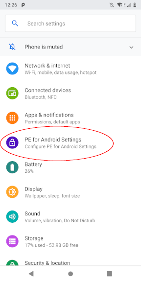
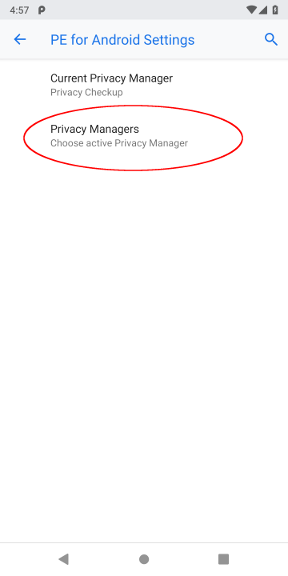

# How-to: develop policy managers

* [Overview](#overview)
* [Example Policy Manager](#example-policy-manager)
* [Permission hooks](#permission-hooks)
* [Registering the service](#registering-the-service)
* [Deploying a Policy Manager](#deploying-a-policy-manager)

## Overview

Policy Managers are trusted apps that have the ability to grant or deny access
to sensitive resources. PE for Android invokes the current active Policy
Manager when apps are installed, as well as when apps request 
[dangerous permissions](https://developer.android.com/guide/topics/permissions/overview)
or use the [Private Data Service](apps.md).

Given this component's privileged position in PE for Android's permission
system, Developers can implement novel permission controls and transparency
tools as Policy Managers. And developers can do so using standard Android app
development and deployment processes, without needing to modify the platform
code itself.

This guide serves as an introduction to the main concepts of Policy Manager
development. The following assumes that the PE for Android SDK addons
are already [installed in Android Studio](sdk.md) and that the addons
have been [included in the project](sdk-project.md). Additionally, as
Policy Managers are trusted components, PE for Android requires that
Policy Manager apps are [properly signed](sdk-project.md#signing-policy-managers-and-upals).

## Example Policy Manager

```java
public class DummyPolicyManagerService extends PolicyManagerService {
    @Override
    public boolean onAppInstall(String packageName, String odp) {
        return true;
    }

    @Override 
    public void onDangerousPermissionRequest(String packageName, String permission,
                                             String purpose, 
                                             List<StackTraceElement[]> stackTrace, 
                                             int flags, 
                                             ComponentName callingComponent, 
                                             ComponentName topActivity,
                                             ResultReceiver recv) {
        Bundle bundle = new Bundle();
        bundle.putBoolean("allowPerm", true);
        recv.send(0, bundle);
    }

    @Override
    public void onPrivateDataRequest(String packageName, String permission, 
                                     String purpose, String pal, 
                                     String description, ResultReceiver recv) {
        Bundle bundle = new Bundle();
        bundle.putBoolean("allowPerm", true);
        recv.send(0, bundle);
     }
}
```

## Permission hooks

The `PolicyManagerService` base class exposes three abstract methods that a
Policy Manager implementation must define:

* `boolean onAppInstall()`: Called when an app is installed
* `void onDangerousPermissionRequest()`: Called when a dangerous permission is requested via the stock Android API
* `void onPrivateDataRequest()`: Called when an app makes a request to the [Private Data Service](apps.md)

All three of these hooks return a true/false result indicating if the corresponding
action was granted. `onDangerousPermissionRequest()` and `onPrivateDataRequest()` do
this via a callback, as those permission checks are done asynchronously.

## Registering the service

```xml
<service
    android:name=".DummyPolicyManagerService"
    android:exported="true"
    android:enabled="true"
    android:permission="android.permission.POLICY_MANAGER_SERVICE">
  <intent-filter>
    <action android:name="android.app.action.DEVICE_POLICY_MANAGER_START" />
  </intent-filter> 
</service>
```

The Policy Manager's core service must declare the `POLICY_MANAGER_SERVICE`
permission in order to use hooks exposed by the PE for Android API.
Additionally, the service needs to listen for broadcasts of the
`android.app.action.DEVICE_POLICY_MANAGER_START` in order to be set
as the active Policy Manager.

## Deploying a Policy Manager

As Policy Managers are regular Android apps (albeit with additional permissions
and a specific signing key), developers and users can install them as they
would any other app: via Android Studio, or with the `adb install` command.

Multiple Policy Managers can be present on a device simultaneously. However,
only one can be set as the active one. The user can set the active Policy
Manager by opening the device's system Settings and using the PE for Android
Settings panel.

 

