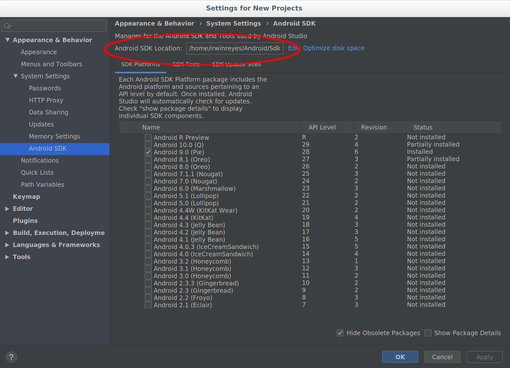

# How-to: including the SDK addons to your project

* [Overview](#overview)
* [build.gradle changes](#buildgradle-changes)
    - [Signing Policy Managers and uPALs](#signing-policy-managers-and-upals)
    - [local.properties workaround](#localproperties-workaround)
* [AndroidManifest.xml changes](#androidmanifestxml-changes)
* [Enabling inline Javadocs](#enabling-inline-javadocs)

## Overview

The PE for Android SDK addons enable apps to use PE for Android's new
APIs.  Apps that implement Policy Managers, uPALs, or use the Private Data
Service must integrate with the SDK addons.

After [installing the addons](sdk.md), the following steps will allow an Android Studio
project to take advantage of PE for Android's features.

## build.gradle changes

The app-level `build.gradle` file specifies the target platform for the
project. Apps that use PE for Android's features must specify this
accordingly:

```
android {
    ...

	compileSdkVersion 'Two Six Labs:PE for Android:28'

	...

    defaultConfig {
        ...
        minSdkVersion 28
        targetSdkVersion 28
        ...
    }
    
    ...
}
```

### Signing Policy Managers and uPALs

PE for Android considers Policy Managers and uPAL modules as trusted software.
Implementations of these must be signed by the system key, else PE for Android
will block their installation. The following will tell Android Studio to
generate a properly signed APK when compiling the project:

1. Obtain the [PE for Android signing key](https://github.com/twosixlabs/PE_for_Android/raw/master/PE_for_Android.keystore) and save it in the same directory as the app-level `build.gradle`

2. Add the following lines to the app-level `build.gradle`:

```
android {
    ...

    signingConfigs {
        PAL_config {
            keyAlias 'peandroid'
            keyPassword 'peandroid'
            storeFile file('PE_for_Android.keystore')
            storePassword 'peandroid'
        }
    }

    ...

    buildTypes {
        release {
            ...
            signingConfig signingConfigs.PAL_config
            ...
        }

        debug{
            ...
            signingConfig signingConfigs.PAL_config
            ...
        }
    }

    ...
```

### local.properties workaround

There's an unresolved bug that prevents newer versions of Gradle from properly
finding and including the SDK addons library. Explicitly declaring the path to
your Android SDK directory serves as a workaround for this bug.

You can find your Android SDK directory using Android Studio:

1. Open any Android Studio project
2. Open the "Tools" menu and select "SDK Manager"
3. The Android SDK location will be shown near the top of the window



After obtaining this information, create a `local.properties` file in your Android
Studio project's top-level directory (if it doesn't already exist). Include the
following line to declare the path to your Android SDK. Change accordingly to
where the SDK is installed on your system.

```
sdk.dir=/home/user/Android/Sdk
```

## AndroidManifest.xml changes

You will need to include the appropriate PE for Android library within your app's manifest. The library you include will vary
depending on if you are creating a PE for Android App, a Policy Manager, or a uPAL

| Project Type       | Library                                   |
|--------------------|-------------------------------------------|
| PE for Android App | `com.twosixlabs.peandroid`                |
| Policy Manager     | `com.twosixlabs.peandroid.privacymanager` |
| uPAL               | `com.twosixlabs.peandroid.pal`            |

The necessary library can be included by adding a `uses-library` line to the `<application>` tag of your apps manifest.

```xml
<uses-library android:name="com.twosixlabs.peandroid.privacymanager" />
```

## Enabling inline Javadocs and code autocomplete

The PE for Android SDK addons come with Javadocs-style inline documentation. The
following steps will enable Android Studio to show this documentation in the
editor:

1. In the 'Project' pane on the left of Android Studio, switch the view to
 **'Project'**
2. Expand **Exeternal Libraries** and right click on the library you would
like to add JavaDocs for
    1. This will correspond to the library you specified in your
    AndroidManifest.xml (i.e. **privacymanager-android-28**)
3. Click on **'Library Properties'**
4. Click the **'+'** button to open a file browser dialog
	1. It should open to the **'libs'** directory of the SDK Addon
5. Expand the **'docs'** directory and select the documentation
directory for the library you are using.
6. Android Studio should detect these as JavaDocs, and you can select "OK"

After completing this process you should now be able to launch **'Quick
Documentation'** or **'External Documentation'** through Android Studio's
shortcuts or by clicking on **View->Quick Documentation** 

To enable proper autocomplete features in Android Studio, you will also need
to add the peandroid stubbed source files. Enabling this is essentially the
same as enabling JavaDocs.

1. Like before, open **'Library Properties'** for the specified library.
2. Click the **'+'** button to open a file browser dialog
3. Expand the **'src'** dialog, and select the proper .jar file for your
library (i.e. **privacymanager.jar**)
4. Android Studio should detect these as Sources, and you can select "OK"

The latest version of standalone Javadocs may be found on the PE for Android webpage [here](https://android-privacy.org/#documentation)