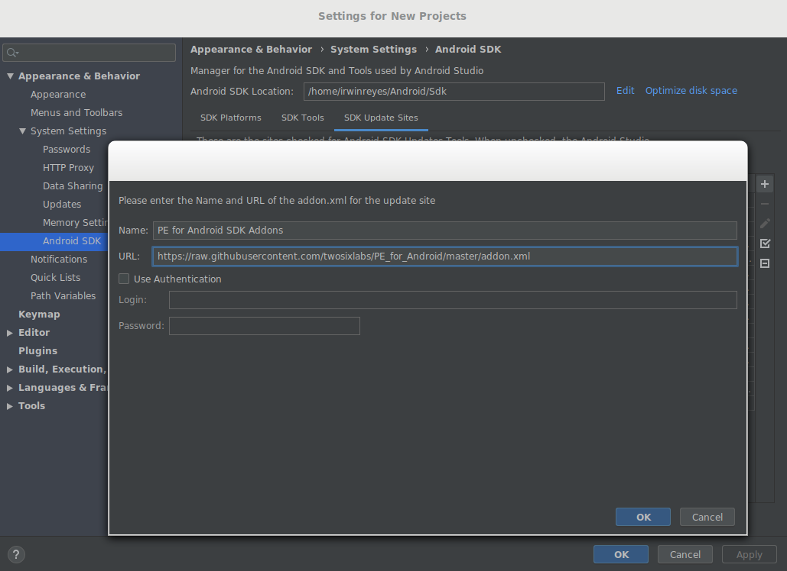
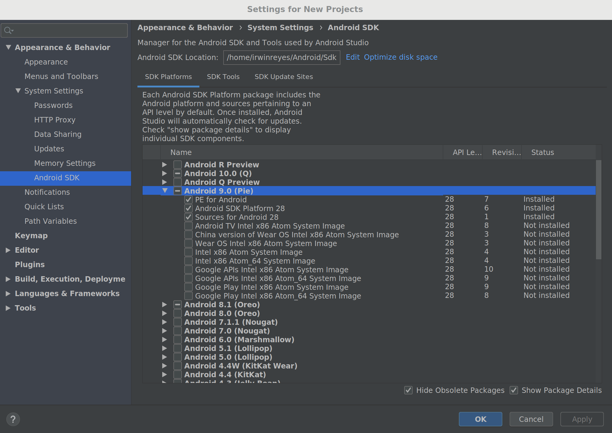

# How-to: install the SDK addons

## Overview

These instructions show how to install the SDK addons in Android Studio.
Specific usage instructions are detailed in the individual how-to's for
developing [apps that use the Private Data Service](apps.md), [Policy
Managers](policy.md), and [uPAL modules](upal.md).

## Installing the SDK addons

We offer precompiled SDK addons that can be installed using Android Studio's
built-in SDK manager.

1. Open any Android Studio project.
2. Open the "Tools" menu and select the "SDK Manager" tab
3. Click the "SDK Update Sites" tab
4. On the right side of the window, click the `+` button to add a site
5. Enter the following details:

```
Name: PE for Android SDK Addons
URL: https://raw.githubusercontent.com/twosixlabs/PE_for_Android/master/addon.xml
```



6. After adding the site, enable it by checking the box
7. Click "OK" in the SDK Manager to accept this new site
8. Open the SDK manager again and wait for the "SDK Platforms" tab to populate
9. Check the box for "Show Package Details"
10. Expand the options under "Android 9.0 (Pie)" and ensure that PE for
Android, Android SDK Platform 28, and Sources for Android 28 are enabled as shown:



11. Click "OK" in the SDK Manager to accept these SDK options

### Custom SDK addons

If you compiled your own version of PE for Android, you can generate
corresponding SDK addons that capture any API changes you may have implemented.
See the [build instructions](../platform/platform.md) for details about
packaging your own SDK addons. To install custom versions of the SDK addons in
Android Studio, simply change the URL in step 5 above to point to local file
path of the generated `addon.xml`.

